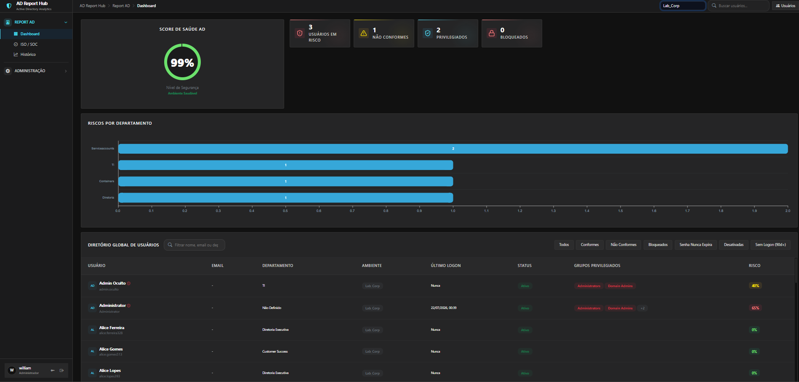
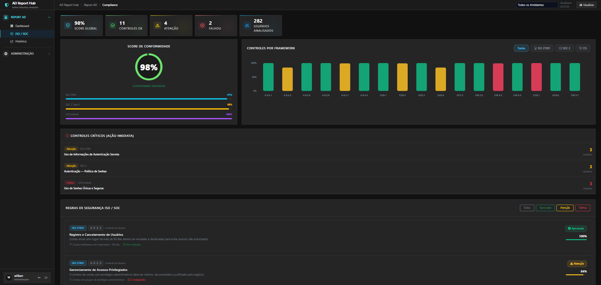
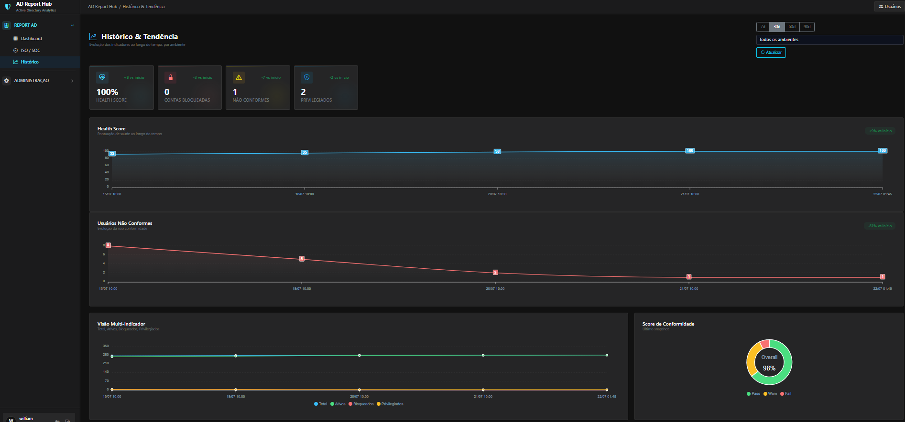

# AD Report Hub 🛡️

*🌎 Read this in other languages: [English](README.md), [Português](README.pt-br.md).*
**AD Report Hub** is an open-source, community-driven platform designed to simplify Active Directory security monitoring, privilege governance, risk scoring, and compliance tracking (ISO 27001 & SOC 2 Type II).

---

## 🚀 Key Features

- 👤 **Active Directory User & Account Auditing**: Tracks active, inactive, locked out, and disabled domain accounts.
- ⚡ **Risk Scoring Engine**: Automatically calculates account risk scores based on inactivity, expired passwords, administrative privileges, Service Principal Names (SPNs), and non-expiring passwords.
- 🛡️ **Privilege & Governance Tracking**: Identifies privileged account memberships (Domain Admins, Enterprise Admins, Schema Admins, Administrators, etc.) and service accounts.
- 📊 **Compliance Dashboard**: Maps AD account metrics to **ISO 27001:2022** and **SOC 2 Type II** controls.
- 📝 **Approved Exception Management**: Register and manage formal security exceptions for legitimate accounts (e.g. legacy service accounts, long-running batch jobs).
- 🔄 **Automated Data Collector**: Lightweight PowerShell script (`scripts/report_ad.ps1`) for seamless integration with Windows Task Scheduler or manual execution.

---

## 📸 Screenshots







---

## 🏗️ Architecture & Flow

```text
Active Directory (Domain Controller)
              │
              ▼
    [report_ad.ps1 Collector]
    (Executes on AD Domain Server)
              │
              ▼ HTTP POST (X-API-Key) / Local JSON Export
      [AD Report Hub]
      (Flask Web Application)
              │
              ▼
   [Security & Compliance Dashboard]
```

---

## 🛠️ Quick Start Guide

### Prerequisites
- **Python 3.9+**
- **PowerShell 5.1+** with the `ActiveDirectory` RSAT module installed on the Domain Controller or domain-joined management machine.

### 1. Installation

The easiest way to get started is by using the built-in automated installer for Windows:

```powershell
git clone https://github.com/wweber993/ad-report-hub.git
cd ad-report-hub

# Run the automated installer wizard
.\install_hub.ps1
```

The installer will interactively prompt you for the necessary configurations (port, ingestion token), set up a Python virtual environment, install all dependencies, and help you create the first Administrator account.

### 2. Manual Installation (Linux Production Server)

For a production environment on Linux (e.g., Ubuntu/Debian), we recommend deploying the application under `/opt/report-hub`.

```bash
# 1. Update and install dependencies
sudo apt update
sudo apt install python3 python3-venv python3-pip git -y

# 2. Clone repository to /opt
cd /opt
sudo git clone https://github.com/wweber993/ad-report-hub.git report-hub
sudo chown -R $USER:$USER /opt/report-hub
cd report-hub

# 3. Create virtual environment and install packages
python3 -m venv venv
source venv/bin/activate
pip install -r requirements.txt

# 4. Configure environment variables
cp .env.example .env
# Edit .env to set your INGEST_TOKEN, PORT, and WEBHOOK_URL
nano .env

# 5. Initialize database and create the first administrator
python create_admin.py
```

### 3. Run Web Application

Start the web application using the virtual environment:

#### Windows:
```powershell
.\venv\Scripts\python app.py
```

#### Linux/macOS (Development):
```bash
python app.py
```

#### Production Mode (Systemd + Gunicorn on Linux):
To keep the application running in the background, you can set up a Systemd service.
Create a file at `/etc/systemd/system/report-hub.service`:

```ini
[Unit]
Description=AD Report Hub Daemon
After=network.target

[Service]
User=www-data
Group=www-data
WorkingDirectory=/opt/report-hub
Environment="PATH=/opt/report-hub/venv/bin"
ExecStart=/opt/report-hub/venv/bin/gunicorn -w 4 -b 0.0.0.0:8090 app:app

[Install]
WantedBy=multi-user.target
```

Then enable and start the service:
```bash
sudo systemctl daemon-reload
sudo systemctl enable report-hub
sudo systemctl start report-hub
```

Access the application in your web browser at: `http://<your-server-ip>:8090/`
*Note: On your first login, you will be prompted to set up your Authenticator App (Google Authenticator / Authy) for Two-Factor Authentication.*

---

## 📊 Data Collection Script (`scripts/report_ad.ps1`)

The collector script runs on any Windows server with AD RSAT tools installed.

### Configuration

Instead of typing long CLI parameters or dealing with extra files, all configuration is handled via variables at the top of **`scripts/report_ad.ps1`**.
Simply open the script in any text editor and update the `$CONFIG` block:

```powershell
$CONFIG = @{
    Environment = "Production"
    ApiUrl      = "http://localhost:8090/ad/api/ingest"
    ApiToken    = "your_secret_ingest_token_here"
    # ... other options
}
```

Then run the collector without any arguments:

```powershell
powershell -ExecutionPolicy Bypass -File .\scripts\report_ad.ps1
```

### Automatic Windows Scheduled Task Setup

To easily run the collector daily on your Active Directory server, you can use the built-in installer switch:

```powershell
powershell -ExecutionPolicy Bypass -File .\scripts\report_ad.ps1 -InstallTask -TaskTime "02:00"
```

This registers a daily task named `ADReportHub_Collector` running under `SYSTEM` privileges using the current script.

---

## 🔒 Security & Best Practices

- **Token Security**: Always set a strong `INGEST_TOKEN` in `.env` and pass it via `-ApiToken` in `report_ad.ps1`.
- **HTTPS/SSL**: Enable SSL certificates in production by setting `SSL_CERT` and `SSL_KEY` in `.env` or placing Gunicorn/Nginx behind a reverse proxy.

---

## 🤝 Contributing & Community

Contributions, feature requests, and bug reports are welcome! Feel free to open issues or submit Pull Requests.

## 📄 License

This project is open-source under the **MIT License**.
